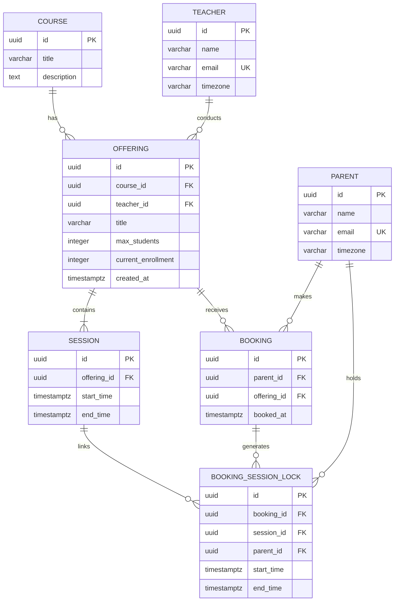
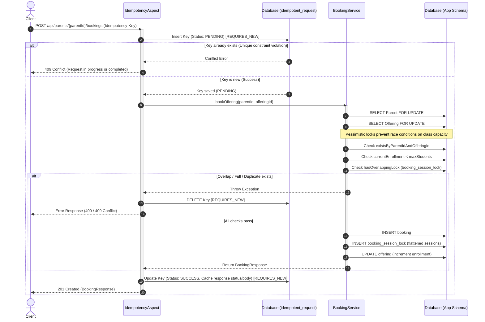
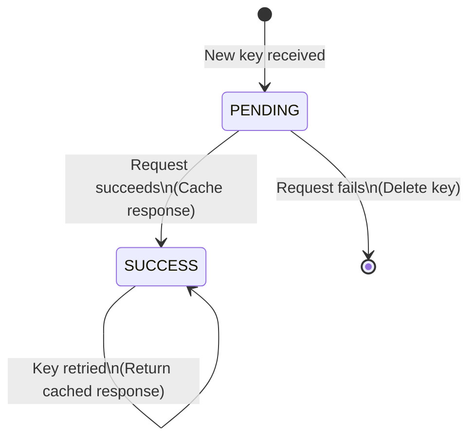
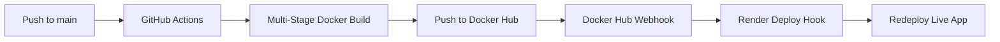

# Global Class Offering Booking System

A production-ready Spring Boot backend service for a global live-learning platform where teachers conduct online classes for students across different countries and timezones.

### 🌐 Live Deployment
The application is deployed live on Render backed by a serverless **Neon PostgreSQL** database:
* **Base URL**: [https://booking-service-latest-400c.onrender.com](https://booking-service-latest-400c.onrender.com)
* **Swagger UI**: [https://booking-service-latest-400c.onrender.com/swagger-ui.html](https://booking-service-latest-400c.onrender.com/swagger-ui.html)
* **OpenAPI Docs**: [https://booking-service-latest-400c.onrender.com/api-docs](https://booking-service-latest-400c.onrender.com/api-docs)

> [!WARNING]
> **Cold Start Notice**: Because the service is hosted on Render's Free tier and backed by Neon's serverless DB, both the web server and database compute instances spin down after inactivity. The first API request or Swagger UI load can take **50–90 seconds** to wake up. Subsequent requests will be near-instantaneous.

---

## 🛠️ Tech Stack

* **Core**: Java 21 & Spring Boot 3.5.14
* **Database**: PostgreSQL 16
* **Database Migration**: Flyway
* **API Documentation**: Springdoc OpenAPI / Swagger UI
* **DevOps**: Docker, Docker Compose, and GitHub Actions (CI/CD)
* **Build Tool**: Maven

---

## 🚀 Getting Started

### Prerequisites
* Java 21 installed locally (if running outside Docker)
* Docker and Docker Compose installed

### Run Locally (with Docker Compose)
The easiest way to boot the database and the application together is via Docker Compose:

1. Clone the repository:
   ```bash
   git clone <repository-url>
   cd booking-service
   ```
2. Build the application and start all services:
   ```bash
   docker-compose up --build
   ```
3. The server will start up on port `8080`.
4. Swagger UI is available at: [http://localhost:8080/swagger-ui.html](http://localhost:8080/swagger-ui.html)
5. OpenAPI raw docs are available at: [http://localhost:8080/api-docs](http://localhost:8080/api-docs)

---

## 💾 Database Schema

The system uses Flyway migrations to manage the schema state in PostgreSQL.



---

## 🔄 Process Diagrams & Request Lifecycles

### 1. Request Lifecycle with Retry-Safe Idempotency & Locking
This diagram shows how a parent's booking request is routed through the `@Idempotent` aspect, database locks are acquired, conflicts are evaluated against the flattened session cache, and how failures or successes update the idempotency store.



### 2. Idempotency State Machine



---

## ⚡ Key Architecture & Design Choices


### 1. Concurrency Handling & Seat Inventory Safety
To protect class caps and prevent over-enrollment under concurrent load, the system uses **Pessimistic Locking** (`SELECT FOR UPDATE`). 
* When a booking transaction starts, it locks the `Parent` and the `Offering` rows sequentially to enforce sequence checks.
* It locks all current `Session` records for the offering.
* This creates a strict, orderly queue when a hot class drops. The first incoming request gets the lock, registers the booking, updates enrollment, and releases the lock. Subsequent concurrent bookings will safely read the updated capacity or see a clean `"Offering is full"` error instantly, rather than experiencing messy database transaction rollbacks.

### 2. Fast Schedule Conflict Detection
To satisfy the rule **"Parent should not be able to book another offering that overlaps with any session timing already booked"**, we implemented a denormalized helper table `booking_session_lock`.
* When a parent successfully books an offering, the start and end times of every session are flattened and saved under the parent's ID in this table.
* To check for conflicts in future bookings, we perform a single, index-only range search:
  ```sql
  SELECT 1 FROM booking_session_lock 
  WHERE parent_id = :parentId 
    AND start_time < :newEndTime 
    AND end_time > :newStartTime;
  ```
* This is heavily optimized via a composite index: `CREATE INDEX idx_lock_parent_times ON booking_session_lock(parent_id, start_time, end_time)`. This bypasses expensive N-way joins between bookings, offerings, and sessions.

### 3. Timezone Handling
* All database fields tracking start, end, booking, and request times use the standard Postgres `TIMESTAMPTZ` type.
* Times are always stored and written in **UTC** internally.
* Users (`Teacher` and `Parent`) profiles contain a timezone string (e.g. `America/New_York`, `Asia/Kolkata`).
* When retrieving offerings or sessions, the application dynamically shifts the stored UTC `Instant` to the client's local timezone using Java's `ZoneId` mapping at the API boundary, ensuring dates are presented with correct localized offsets.

### 4. Retry-Safe Idempotency
To prevent double-bookings or duplicates due to network retry loops, we support the standard `Idempotency-Key` header.
* We intercept requests with a custom `@Idempotent` annotation and an AOP aspect.
* The request key is saved to an `idempotent_request` database table with state `PENDING` in a new transaction.
* If a concurrent request with the same key arrives, a database constraint exception is caught, returning a `409 Conflict` (request in progress).
* On success, the response status and serialized JSON body are cached. Future retries with the same key are returned directly from the cache without hitting the database/application logic.
* An hourly scheduler clears key mappings older than 24 hours to keep the database lean.

---

## 🚀 CI/CD & Auto-Deployment Flow

The project is configured with a fully automated build and deployment pipeline:



1. **Continuous Integration (GitHub Actions)**:
   * On every push to the `main` branch, the GitHub Actions workflow at `.github/workflows/build-deploy.yml` triggers.
   * It compiles the code and builds the multi-stage Docker container before pushing it to Docker Hub.
2. **Continuous Deployment (Docker Hub Webhook to Render)**:
   * Rather than embedding deploy tokens inside GitHub secrets, a deployment webhook from Render is configured directly inside the **Docker Hub repository settings**.
   * The second Docker Hub receives the updated image, it automatically triggers Render to pull the latest tag and redeploy the live service without manual intervention.

---

## 📡 API Endpoints

### Teacher APIs
* **Create Teacher Profile**: `POST /api/teachers`
* **Get All Teachers**: `GET /api/teachers`
* **Create Offering**: `POST /api/teachers/{teacherId}/offerings`
* **Add Sessions to Offering**: `POST /api/offerings/{offeringId}/sessions` (Supports `Idempotency-Key` header)
* **Get Teacher Offerings**: `GET /api/teachers/{teacherId}/offerings`

### Parent APIs
* **Create Parent Profile**: `POST /api/parents`
* **Get All Parents**: `GET /api/parents`
* **Get Available Offerings**: `GET /api/parents/offerings` (Accepts optional `timezone` query param or `X-Timezone` header to dynamically convert dates)
* **Book Offering**: `POST /api/parents/{parentId}/bookings` (Supports `Idempotency-Key` header)
* **Get Booked Offerings**: `GET /api/parents/{parentId}/bookings`

### Course APIs (Admin/Templates)
* **Create Course Template**: `POST /api/courses`
* **Get All Course Templates**: `GET /api/courses`

---

## 🧪 Testing

We have a suite of tests checking offering setups and session validation.
To run the automated tests:
```bash
mvn test
```

For manual testing, check out [api-tests.http](file:///home/rap/Projects/booking-service/api-tests.http) which provides a sequence of API calls (including conflict and idempotency verification) that can be run directly using tools like the REST Client extension in VS Code.
